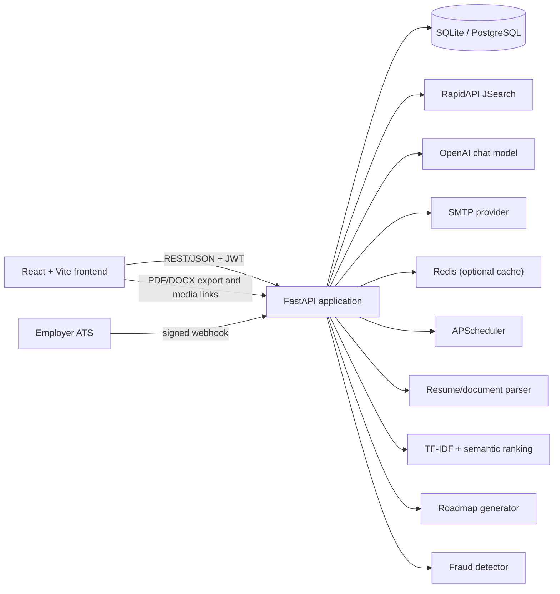
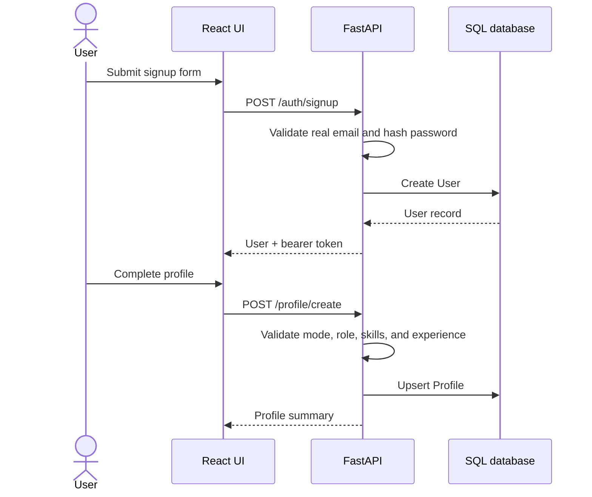
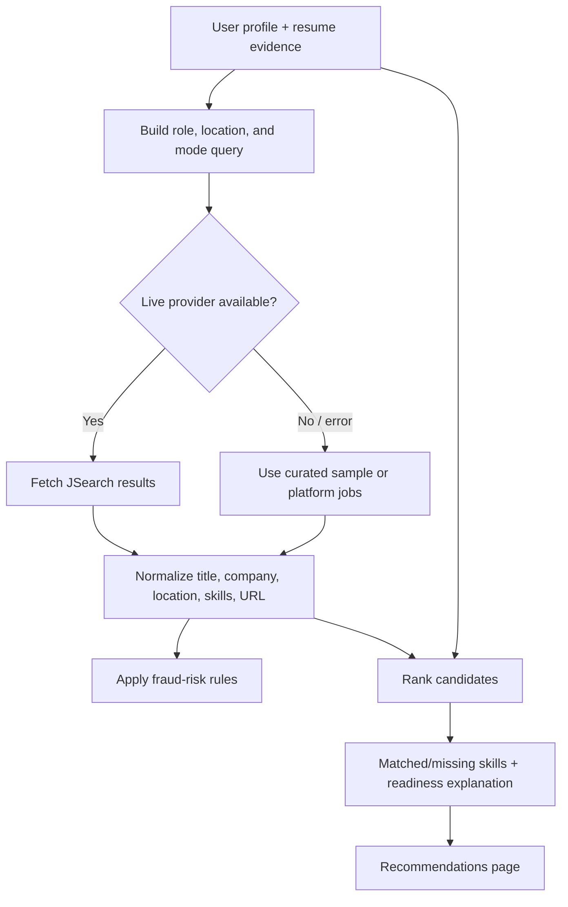
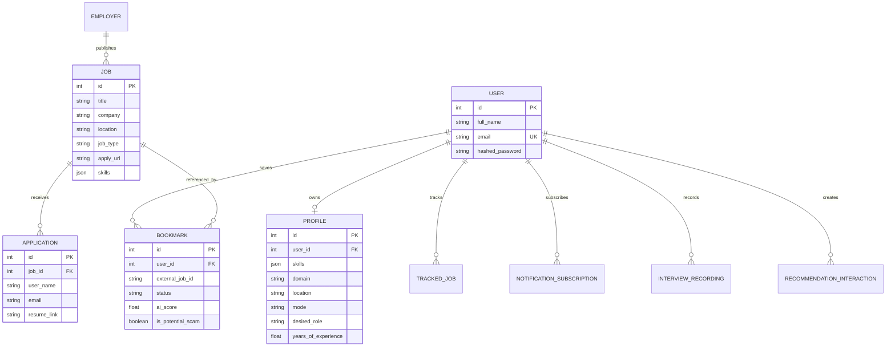
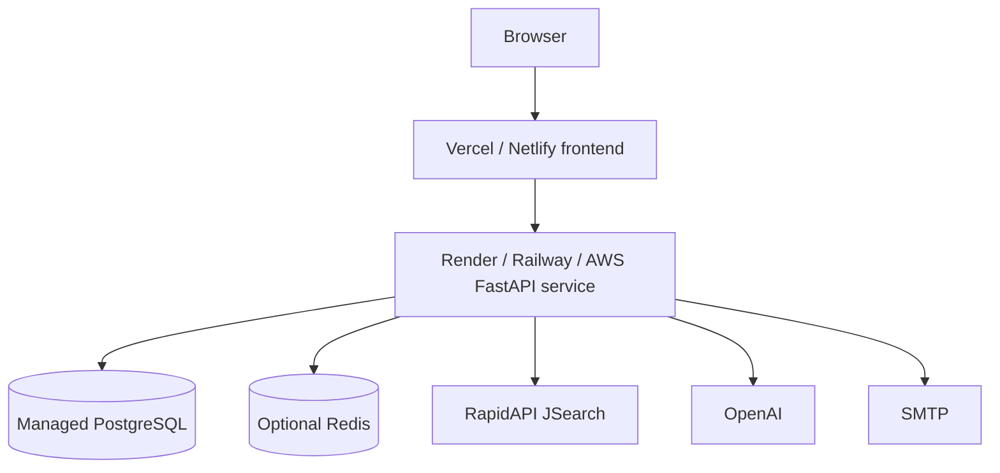

# NextStep AI — System Design

## 1. Purpose

NextStep AI is a full-stack career guidance platform for students, freshers, and
early-career professionals. It combines a user profile and resume evidence with
job-market data to recommend realistic roles, explain skill gaps, and turn those
gaps into a time-bound learning roadmap.

The design prioritizes:

- actionable recommendations instead of a generic job list;
- transparent scores, matched skills, and missing skills;
- a guided loop from profile creation to learning to applications;
- safe handling of authentication, resumes, and employer integrations; and
- graceful local development when external providers are unavailable.

## 2. Product scope

### In scope

- Account registration, login, JWT-based sessions, and protected pages.
- Profile creation for domain, location, skills, experience, desired role, and
  job/internship mode.
- Resume, LinkedIn, and certificate document analysis.
- Live job and internship discovery through RapidAPI JSearch, with curated
  sample data as a development fallback.
- Hybrid job ranking using semantic similarity, TF-IDF, skill overlap, domain
  alignment, and experience alignment.
- Skill-gap dashboards, learning recommendations, and 30/60/90-day roadmaps.
- Bookmarks, application tracking, interview preparation, recordings, and
  notifications.
- AI career mentor chat grounded in the user's career context.
- Fraud-risk warnings for suspicious job postings.
- Employer job creation and ATS webhook synchronization.

### Out of scope

- Guaranteeing employment or making hiring decisions.
- Automatically applying to external jobs.
- Storing or processing payment information.
- Replacing a recruiter, interview panel, or professional career counsellor.

## 3. High-level architecture

### Runtime responsibilities

| Layer | Responsibility | Main implementation |
| --- | --- | --- |
| Presentation | Routing, authentication state, forms, dashboards, visualizations, loading/error states | `frontend/src/` |
| API | Validation, authentication, orchestration, serialization, CORS, static media | `backend/main.py`, `backend/schemas.py` |
| Domain services | Job retrieval, ranking, resume parsing, roadmaps, interviews, fraud analysis, notifications | `backend/job_api.py`, `ml_ranker.py`, `resume_parser.py`, `roadmap_generator.py`, and related modules |
| Persistence | Users, profiles, jobs, bookmarks, applications, tracking, subscriptions, recordings, employers | SQLAlchemy models in `backend/models.py` |
| External services | Live jobs, AI chat, email delivery, optional cache | RapidAPI, OpenAI, SMTP, Redis |

## 4. Frontend design

### Application shell and routes

The React application uses React Router and a shared `AppShell`. Public routes
are the home, login, and signup pages. Protected routes are guarded by
`ProtectedRoute` and include:

- `/profile` — create or update the career profile;
- `/resume` — upload and review extracted resume evidence;
- `/dashboard` and `/skill-gap` — readiness, skill families, market demand,
  achievements, and progress;
- `/recommendations` — ranked jobs and internships;
- `/roadmap` and `/interview-prep` — learning roadmap and interview practice;
- `/bookmarks` — saved jobs and application status;
- `/apply/:jobId` — internal application form; and
- `/chatbot` — contextual career mentor.

`AuthContext`, `ThemeContext`, and `ChatContext` own cross-page state. Axios
centralizes the API base URL, bearer-token injection, and 401 handling.

### UX principles

1. **Progressive disclosure:** show a useful summary first, then expose score
   details, matched skills, missing skills, and source links.
2. **Explainability:** every recommendation should expose why it is relevant,
   not only a numeric score.
3. **Recovery:** network failures, missing profiles, empty results, and missing
   external API credentials must have visible next steps.
4. **Mode awareness:** job and internship mode affect profile validation,
   searches, ranking, and roadmap language.
5. **Responsive visual feedback:** use skeletons, toasts, progress bars, and
   charts for long-running or data-heavy operations.

## 5. Core backend flows

### 5.1 Authentication and profile setup

Passwords are stored as hashes, never as plaintext. The token is sent in the
`Authorization: Bearer` header for protected API calls. The frontend clears an
invalid token and redirects to login after a 401 response.

### 5.2 Resume and document analysis

1. The user uploads a supported resume, LinkedIn export, or certificate.
2. The backend extracts text with `pdfplumber`; PyMuPDF is a fallback for PDFs
   with empty extraction, and OCR can be used for image-based content when
   configured.
3. The parser detects skills, tools, projects, experience highlights,
   certificates, likely roles, and a suggested domain.
4. The backend returns a structured profile draft and a resume audit.
5. The user reviews the draft before saving profile changes.

The parser should treat extracted content as untrusted input: validate file
type and size, store generated filenames rather than user-controlled paths,
and avoid executing uploaded content.

### 5.3 Recommendation pipeline

The ranking layer uses two complementary paths:

- **Lexical ranking:** TF-IDF vectors and cosine similarity between profile/job
  text, plus normalized skill overlap.
- **Semantic ranking:** the semantic recommender indexes platform jobs and
  retrieves close matches for broader language similarity.

The final response should retain source metadata and the original apply URL.
Scores are guidance signals, not hiring probabilities. Fraud analysis adds
warnings and reasons without silently removing every suspicious result.

### 5.4 Roadmap and interview preparation

The roadmap generator selects a career-family blueprint, adapts it to the
profile's detected skills and gaps, and returns staged objectives, tools,
resources, projects, and certifications. The UI presents these as timeline
stages and progress actions.

Interview preparation uses the target role and profile context to generate
question packs. Recordings are stored under the backend media directory with a
database record linking the user, question, generated filename, content type,
and size.

### 5.5 Notifications

Users can subscribe with an email and frequency. APScheduler periodically scans
active subscriptions, finds matching opportunities, and sends email through
the configured SMTP provider. `last_sent_at` prevents repeated delivery in a
single notification window.

### 5.6 Employer ATS integration

Employers configure an ATS provider and webhook settings through the employer
API. Incoming `job.created`, `job.updated`, and `job.deleted` events are
accepted at `/employer/webhook/{employer_id}`. Requests may be verified using
an HMAC SHA-256 signature or a configured webhook secret before changing job
records.

## 6. Data model

SQLite is the local default. PostgreSQL is the production target and is
migrated with Alembic. JSON columns are used for flexible skill lists,
structured raw jobs, badges, and fraud reasons; frequently queried ownership
and lookup fields are indexed.

## 7. API contract

### Authentication and profile

- `POST /auth/signup`
- `POST /auth/login`
- `POST /profile/create`
- `GET /profile/view`
- `PUT /profile/update`
- `POST /resume/upload`

### Discovery and career planning

- `GET /recommend/jobs`
- `GET /recommend/internships`
- `GET /recommend/semantic-jobs`
- `GET /dashboard/skills`
- `GET /roadmap/generate`
- `GET /interview/questions`
- `POST /interview/recordings`

### User actions

- `POST /bookmark/save`
- `GET /bookmark/list`
- `DELETE /api/bookmarks/{job_id}`
- `POST /tracker/update-status`
- `POST /feedback`
- `GET /notifications/subscribe`
- `POST /chatbot/ask`

### Internal and employer job flows

- `POST /jobs`
- `GET /jobs`
- `GET /jobs/{job_id}`
- `POST /apply`
- `GET /employer/integration`
- `PUT /employer/integration`
- `POST /employer/webhook/{employer_id}`

Schemas in `backend/schemas.py` are the source of truth for validation and
response shapes. New endpoints should preserve explicit error responses and
avoid success-shaped fallbacks when required configuration is missing.

## 8. Security and privacy

- Hash passwords using the existing authentication helper.
- Validate email addresses and reject known disposable/test addresses.
- Require authentication for personal profile, resume, bookmark, tracker,
  chatbot, recording, and notification operations.
- Enforce ownership checks for user-owned records and media.
- Verify ATS webhook signatures or secrets before processing events.
- Keep API keys, JWT secrets, SMTP credentials, and database URLs in
  environment variables; never commit `.env` files or credentials.
- Restrict CORS to known frontend origins and explicitly configured preview
  origins.
- Sanitize filenames and constrain upload size/type before writing media.
- Avoid exposing full resume text, tokens, raw provider payloads, or webhook
  secrets in logs and error responses.
- Treat AI output as advisory content and keep provider failures explicit.

## 9. Reliability and observability

### Failure behavior

- Job provider failures fall back to sample/platform data so local discovery
  remains usable, while the response should indicate its source/status.
- Redis is optional; the application uses an in-memory fallback when it is not
  available.
- Resume extraction has a primary parser and PDF fallback.
- Missing OpenAI configuration returns a clear setup error rather than a
  fabricated chatbot answer.
- External apply links remain external; internal applications are validated
  against internal jobs.

### Operational signals

Log structured events for:

- authentication failures and webhook verification failures;
- external provider latency, status, and fallback usage;
- recommendation result counts and ranking failures;
- resume parsing failures and upload rejection reasons;
- notification send failures; and
- unhandled API errors with request correlation identifiers.

Do not log passwords, JWTs, resume contents, API keys, or webhook secrets.

## 10. Deployment topology

### Environments

- **Local:** Vite frontend, Uvicorn backend, SQLite, optional Redis, sample
  fallback data.
- **Staging:** hosted frontend and backend with isolated PostgreSQL and
  provider keys.
- **Production:** hosted frontend, horizontally scalable FastAPI service,
  managed PostgreSQL, optional Redis, durable media storage, SMTP, and
  monitored scheduled jobs.

The current media directory is suitable for local development. Production
should use durable object storage for interview recordings and other user
uploads, with private access or signed URLs.

## 11. Performance considerations

- Cache normalized job searches with a bounded TTL and entry count.
- Reuse the semantic index until the platform job corpus changes.
- Paginate or cap recommendation results before rendering large lists.
- Keep recommendation explanations precomputed in the response rather than
  triggering one API call per job card.
- Move notification scans and expensive resume processing to a worker queue as
  usage grows.
- Add database indexes for user ownership, external job IDs, status, and
  timestamps.

## 12. Testing strategy

### Backend

- Unit-test skill normalization, aliases, scoring, fraud rules, resume section
  extraction, and roadmap selection.
- API-test authentication, profile validation, ownership checks, upload
  rejection, bookmark lifecycle, tracker updates, and webhook verification.
- Use provider mocks for RapidAPI, OpenAI, SMTP, Redis, and ATS callbacks.

### Frontend

- Test protected-route behavior and token expiry handling.
- Test recommendation filters, empty/error states, bookmark and status
  updates, resume draft review, and roadmap progress.
- Run a production Vite build to catch import and bundling errors.

### Acceptance path

1. Register and log in.
2. Create a profile in job mode and verify the profile is persisted.
3. Upload a resume and review extracted skills.
4. Load recommendations and inspect scores, missing skills, and fraud warning.
5. Save a recommendation and change its application status.
6. Generate a roadmap and open interview preparation.
7. Verify external configuration failures are shown clearly.

## 13. Evolution plan

1. Extract recommendation orchestration from `main.py` into focused service
   modules as endpoint count grows.
2. Introduce a background worker for resume parsing, notifications, and
   semantic-index rebuilds.
3. Replace local media storage with object storage and signed download URLs.
4. Add versioned recommendation explanations so score changes are auditable.
5. Add role-specific evaluation datasets to measure ranking quality instead of
   relying only on offline similarity scores.
6. Add privacy controls for deleting resumes, recordings, bookmarks, and the
   complete account.
